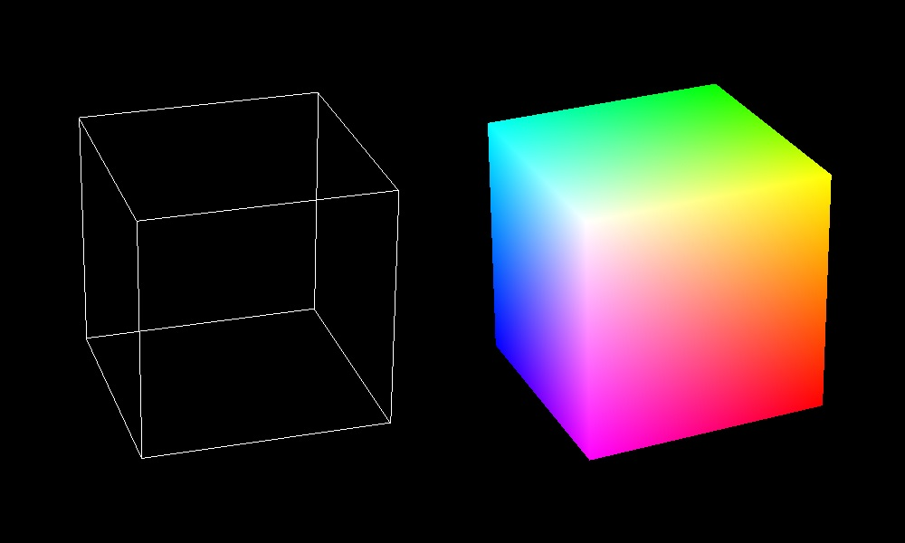

## At a Glance

A simple software renderer based upon rasterization, created for learning purpose.



## Usage

- press `space` to toggle the wire frame mode
- use  `arrow keys`  to control the animation speed

## Build & Run

### Requirements

- Windows
- MinGW or MSVC (Visual Studio 2017)
- CMake

### For MinGW

```shell
mkdir build-mingw
cd build-mingw
cmake .. -G "MinGW Makefiles" -DCMAKE_CXX_COMPILER=clang++
mingw32-make -j 4
start main
```

### For MSVC

```shell
mkdir build-msvc
cd build-msvc
cmake .. -G "Visual Studio 15 2017"
start app.sln
```

## Todo

- texture
- lighting